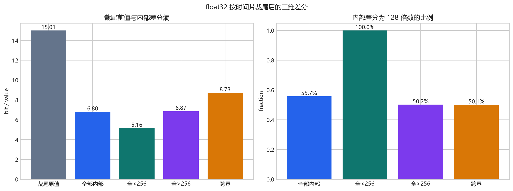
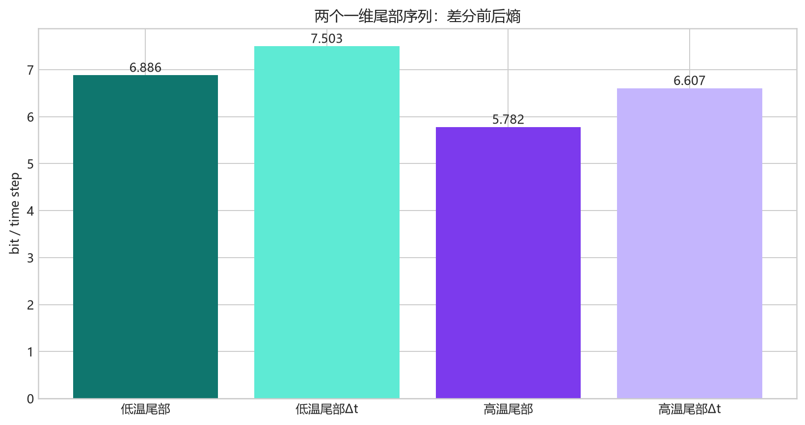

# ERA5 float32 分区裁尾与三维差分统计

## 方法

每个小时分别保存 `<256 K` 的最低 7 位和 `>256 K` 的最低 6 位，然后把相应
尾部清零。全部时间片均通过区域内尾部唯一性和逐元素 bit-exact 恢复校验。
对裁尾位模式按 `time, latitude, longitude` 做可逆三维前向差分。

形状：`(744, 721, 1440)`；处理耗时 `92.24` 秒。
精确 256 K 值共 `84` 个。

## 核心统计

| 对象 | 数量 | 不同值 | 0 占比 | 64 倍数 | 128 倍数 | 熵 (bit/value) |
| --- | ---: | ---: | ---: | ---: | ---: | ---: |
| 裁尾 uint32 | 772,450,560 | 62,704 | 0.000000% | 100.000000% | 55.724170% | 15.0087 |
| 全部内部差分 | 769,807,440 | 7,562 | 8.031031% | 100.000000% | 55.729572% | 6.8025 |
| stencil 全 <256 K | 85,753,005 | 2,888 | 15.664000% | 100.000000% | 100.000000% | 5.1600 |
| stencil 全 >256 K | 679,998,985 | 7,346 | 7.110041% | 100.000000% | 50.180553% | 6.8717 |
| 跨越/接触 256 K | 4,055,450 | 5,036 | 1.058230% | 100.000000% | 50.059426% | 8.7312 |
| 低温 7-bit 尾部 | 744 | 128 | 0.403226% | 1.881720% | 0.403226% | 6.8865 |
| 低温尾部 Δt | 743 | 222 | 0.403769% | 1.345895% | 0.403769% | 7.5034 |
| 高温 6-bit 尾部 | 744 | 64 | 2.284946% | 2.284946% | 2.284946% | 5.7817 |
| 高温尾部 Δt | 743 | 121 | 0.942127% | 0.942127% | 0.942127% | 6.6074 |

## 观察

- 裁尾后全部输入整数均为 64 的倍数；低于 256 K 的输入均为 128 的倍数。
- 内部差分熵为 `6.8025 bit/value`，0 占 `8.031031%`。
- 完整差分张量分区加权边际熵为 `6.7982 bit/value`。
- 低温/高温尾部序列原始熵分别为 `6.8865`/`5.7817`，时间差分后为 `7.5034`/`6.6074`。
- 清尾消除了 256 K 两侧斜率不同所导致的非 64 倍数，但跨界 stencil 不保证为 128 倍数。

## 输出

`results.json` 保存摘要和 744 个尾部值；完整频数位于 `histograms/`。

## 图表

