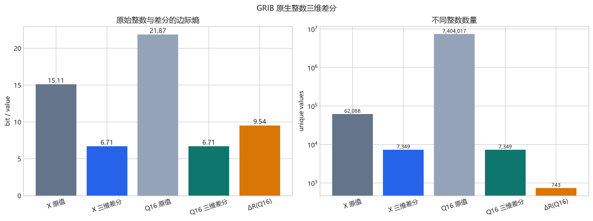
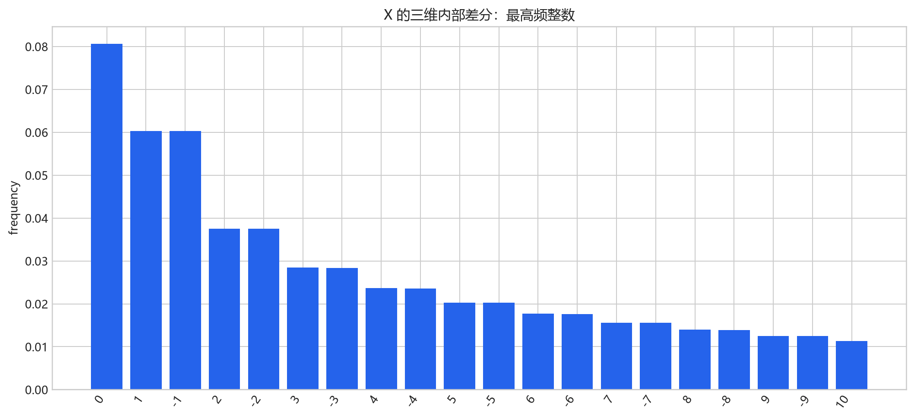

# ERA5 GRIB 原生整数与三维差分统计

## 方法与校验

逐 message 读取 GRIB1 Binary Data Section，并按 big-endian uint16 直接解包 `X`。
当前 744 个 message 均为 `grid_simple`、16 bit、无 bitmap，且 `E=-9,D=0`。
参考值全部位于 `[128,256)`，所以 `r=R·2^16` 是精确整数；统一 Q16 格点为
`Q=r+128X`。BDS 原始整数已与 ecCodes 解码值逐元素核对。

形状：`(744, 721, 1440)`；处理耗时 `102.79` 秒。
最大重建误差：`0.0` K。

## 核心统计

| 对象 | 数量 | 不同值 | 最小值 | 最大值 | 0 占比 | 熵 (bit/value) |
| --- | ---: | ---: | ---: | ---: | ---: | ---: |
| r_t = R_t·2^16 | 744 | 743 | 12,963,696 | 13,874,271 | 0.000000% | 9.5365 |
| Δr_t | 743 | 743 | -177,994 | 163,260 | 0.000000% | 9.5372 |
| X 原始整数 | 772,450,560 | 62,088 | 0 | 63,182 | 0.000100% | 15.1074 |
| X 三维内部差分 | 769,807,440 | 7,349 | -8,790 | 6,838 | 8.063770% | 6.7118 |
| Q=r+128X 原值 | 772,450,560 | 7,404,017 | 12,963,696 | 21,240,256 | 0.000000% | 21.8718 |
| Q 三维内部差分 | 769,807,440 | 7,349 | -1,125,120 | 875,264 | 8.063770% | 6.7118 |

## 观察

- `r_t` 有 `743` 个不同值；一阶差分熵为 `9.5372 bit/value`。
- X 原始边际熵为 `15.1074`，内部三维差分为 `6.7118 bit/value`。
- X 完整差分张量的分区加权边际熵为 `6.7077 bit/value`。
- 统一 Q16 格点内部差分熵为 `6.7118`；该基线把每小时变化的参考值重新并入场值。
- 边际熵不包含上下文模型和实际码流开销，不能直接等同于最终压缩率。

## 输出

`results.json` 保存所有摘要；`histograms/*.csv.gz` 保存完整精确频数。

## 图表

