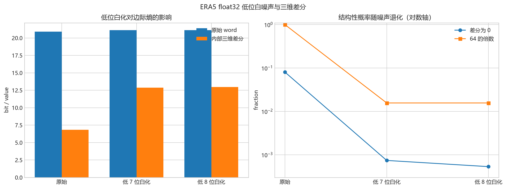
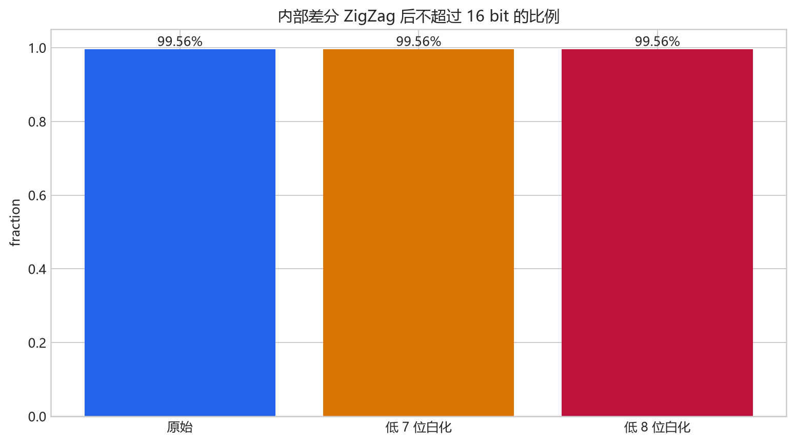

# ERA5 float32 低位白噪声与三维差分统计

## 方法

保持每个 float32 位模式的高位不变，把最低 7 位或最低 8 位替换为时空独立的
均匀随机整数。随机种子为 `2311`。这是一种严格限制在指定低位内的白化实验，
不是可能产生高位进位的高斯数值加法。

形状：`(744, 721, 1440)`；处理耗时 `745.98` 秒。

## 温度扰动

- 7-bit：RMSE `0.00152999` K，最大绝对误差 `0.00387573` K。
- 8-bit：RMSE `0.00305193` K，最大绝对误差 `0.00778198` K。

## 核心统计

| 数据 | 原始 word 熵 | 内部差分熵 | 内部不同值 | 内部 0 占比 | 内部 64 倍数 | 全差分加权熵 |
| --- | ---: | ---: | ---: | ---: | ---: | ---: |
| 原始 | 20.8994 | 6.8358 | 104,243 | 8.029835% | 99.777895% | 6.8315 |
| 最低 7 位白化 | 21.1180 | 12.8706 | 257,693 | 0.073946% | 1.562732% | 12.8685 |
| 最低 8 位白化 | 21.1182 | 12.9654 | 257,537 | 0.053237% | 1.562406% | 12.9641 |

## 解释

- 白化只破坏低位规则，不改变符号、指数和高位尾数，因此宏观温度场保持不变。
- 原始与噪声版本之间的差分熵变化，直接反映现有收益中有多少来自 GRIB 定点尾部。
- 若噪声后仍明显低于原始 word 熵，剩余收益主要来自温度场的时空相关性。
- 边际熵不利用邻域上下文，因此只是实际压缩器的比较基线。

## 输出

`results.json` 保存摘要；`histograms/*.csv.gz` 保存三个版本全部区域的精确频数。

## 图表

