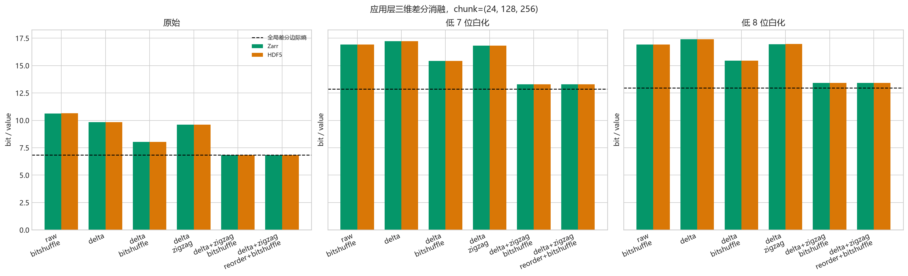
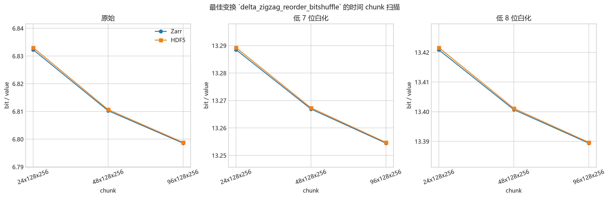

# 三维差分在 Zarr/HDF5 中的应用层预变换实测

## 实验设计

每个存储 chunk 独立执行可逆变换，保证随机读取时只需解码目标 chunk。float32 被按位解释为
uint32，三维差分与逆累加均在模 2^32 算术下进行。所有结果均逐 chunk 解码，并与输入
float32 位模式逐元素比较。

两种格式均使用 Blosc-Zstd level 5；带 bitshuffle 的模式在两种格式中使用相同过滤器。
张量形状：`(744, 721, 1440)`，每组 `772,450,560` 个值。

## 默认 chunk 的变换消融

默认 chunk：`(24, 128, 256)`。正的改善量表示比同格式 raw float32 baseline 更小。

| 数据 | 模式 | Zarr bit/value | HDF5 bit/value | Zarr 改善 | HDF5 改善 |
| --- | --- | ---: | ---: | ---: | ---: |
| 原始 | `raw_bitshuffle` | 10.6363 | 10.6369 | +0.0000 | +0.0000 |
| 原始 | `delta_noshuffle` | 9.8417 | 9.8424 | +0.7947 | +0.7945 |
| 原始 | `delta_bitshuffle` | 8.0259 | 8.0266 | +2.6104 | +2.6103 |
| 原始 | `delta_zigzag_noshuffle` | 9.5987 | 9.5994 | +1.0376 | +1.0375 |
| 原始 | `delta_zigzag_bitshuffle` | 6.8383 | 6.8390 | +3.7981 | +3.7979 |
| 原始 | `delta_zigzag_reorder_bitshuffle` | 6.8323 | 6.8330 | +3.8040 | +3.8039 |
| 低 7 位白化 | `raw_bitshuffle` | 16.9097 | 16.9111 | +0.0000 | +0.0000 |
| 低 7 位白化 | `delta_noshuffle` | 17.2363 | 17.2370 | -0.3265 | -0.3259 |
| 低 7 位白化 | `delta_bitshuffle` | 15.4109 | 15.4117 | +1.4988 | +1.4994 |
| 低 7 位白化 | `delta_zigzag_noshuffle` | 16.8192 | 16.8200 | +0.0905 | +0.0912 |
| 低 7 位白化 | `delta_zigzag_bitshuffle` | 13.2852 | 13.2859 | +3.6245 | +3.6252 |
| 低 7 位白化 | `delta_zigzag_reorder_bitshuffle` | 13.2885 | 13.2893 | +3.6212 | +3.6219 |
| 低 8 位白化 | `raw_bitshuffle` | 16.9116 | 16.9130 | +0.0000 | +0.0000 |
| 低 8 位白化 | `delta_noshuffle` | 17.4063 | 17.4071 | -0.4948 | -0.4942 |
| 低 8 位白化 | `delta_bitshuffle` | 15.4432 | 15.4440 | +1.4683 | +1.4690 |
| 低 8 位白化 | `delta_zigzag_noshuffle` | 16.9597 | 16.9605 | -0.0481 | -0.0475 |
| 低 8 位白化 | `delta_zigzag_bitshuffle` | 13.4231 | 13.4239 | +3.4885 | +3.4891 |
| 低 8 位白化 | `delta_zigzag_reorder_bitshuffle` | 13.4209 | 13.4216 | +3.4907 | +3.4914 |

## Chunk 扫描

默认消融后，跨两种格式和三组数据平均最好的差分模式为 `delta_zigzag_reorder_bitshuffle`。

| 数据 | chunk | chunk 内边界比例 | Zarr bit/value | HDF5 bit/value |
| --- | --- | ---: | ---: | ---: |
| 原始 | `(24, 128, 256)` | 5.287% | 6.8323 | 6.8330 |
| 原始 | `(48, 128, 256)` | 3.228% | 6.8103 | 6.8107 |
| 原始 | `(96, 128, 256)` | 2.198% | 6.7986 | 6.7988 |
| 低 7 位白化 | `(24, 128, 256)` | 5.287% | 13.2885 | 13.2893 |
| 低 7 位白化 | `(48, 128, 256)` | 3.228% | 13.2669 | 13.2673 |
| 低 7 位白化 | `(96, 128, 256)` | 2.198% | 13.2545 | 13.2547 |
| 低 8 位白化 | `(24, 128, 256)` | 5.287% | 13.4209 | 13.4216 |
| 低 8 位白化 | `(48, 128, 256)` | 3.228% | 13.4007 | 13.4011 |
| 低 8 位白化 | `(96, 128, 256)` | 2.198% | 13.3894 | 13.3897 |

## 最佳实际文件

- 原始 ZARR：最佳 `delta_zigzag_reorder_bitshuffle` / `(96, 128, 256)` 为 `626.03` MiB、`6.7986` bit/value、相对 float32 为 `4.707×`，相对 raw baseline 减少 `3.8378` bit/value（`36.08%`）。
- 原始 HDF5：最佳 `delta_zigzag_reorder_bitshuffle` / `(96, 128, 256)` 为 `626.06` MiB、`6.7988` bit/value、相对 float32 为 `4.707×`，相对 raw baseline 减少 `3.8381` bit/value（`36.08%`）。
- 低 7 位白化 ZARR：最佳 `delta_zigzag_reorder_bitshuffle` / `(96, 128, 256)` 为 `1220.52` MiB、`13.2545` bit/value、相对 float32 为 `2.414×`，相对 raw baseline 减少 `3.6552` bit/value（`21.62%`）。
- 低 7 位白化 HDF5：最佳 `delta_zigzag_reorder_bitshuffle` / `(96, 128, 256)` 为 `1220.54` MiB、`13.2547` bit/value、相对 float32 为 `2.414×`，相对 raw baseline 减少 `3.6564` bit/value（`21.62%`）。
- 低 8 位白化 ZARR：最佳 `delta_zigzag_reorder_bitshuffle` / `(96, 128, 256)` 为 `1232.94` MiB、`13.3894` bit/value、相对 float32 为 `2.390×`，相对 raw baseline 减少 `3.5222` bit/value（`20.83%`）。
- 低 8 位白化 HDF5：最佳 `delta_zigzag_reorder_bitshuffle` / `(96, 128, 256)` 为 `1232.96` MiB、`13.3897` bit/value、相对 float32 为 `2.390×`，相对 raw baseline 减少 `3.5233` bit/value（`20.83%`）。

原始数据最佳 Zarr 文件比当前 raw Zarr baseline 实际减少约 `353.39` MiB。

## 时间开销

下表为默认 chunk、原始数据的时间；写入时间包含同一次遍历中同时写 Zarr 与 HDF5，
验证时间包含两种格式的逐 chunk 解码和位级比较。

| 模式 | 双格式写入（秒） | 双格式验证（秒） |
| --- | ---: | ---: |
| `raw_bitshuffle` | 75.65 | 15.04 |
| `delta_noshuffle` | 274.74 | 39.26 |
| `delta_bitshuffle` | 43.37 | 34.03 |
| `delta_zigzag_noshuffle` | 277.69 | 42.89 |
| `delta_zigzag_bitshuffle` | 59.52 | 40.66 |
| `delta_zigzag_reorder_bitshuffle` | 60.28 | 41.60 |

## 判读原则

- `raw_bitshuffle` 与此前通用容器基线使用同一核心配置，因此改善量是实际文件大小差，不是熵差。
- `delta_noshuffle` 与 `delta_bitshuffle` 分离 bitshuffle 的作用；ZigZag 模式检验正负小残差映射
  是否有利于 Zstd；region reorder 检验将内部、三个平面、三条棱和顶点连续排列是否有效。
- chunk 内边界比全局变换更多，所以实际码率不应直接等于 6.83 bit/value 的全局边际熵。
- 只有实际文件小于 raw baseline 且逐位恢复通过，才能认为这一应用层方案获得了真实无损收益。

## 兼容性限制

当前文件是应用层预变换原型：数据集物理 dtype 为 uint32，普通 Zarr/HDF5 客户端读到的是编码残差，
必须通过本项目的逆变换才能得到 float32 温度。要做到对 xarray/h5py 用户透明，下一阶段需要把相同
变换包装成 Zarr codec 或 HDF5 filter plugin。

## 图表

完整机器可读结果位于 `data/3-dim-diff-zarr-hdf5/results.json`。
