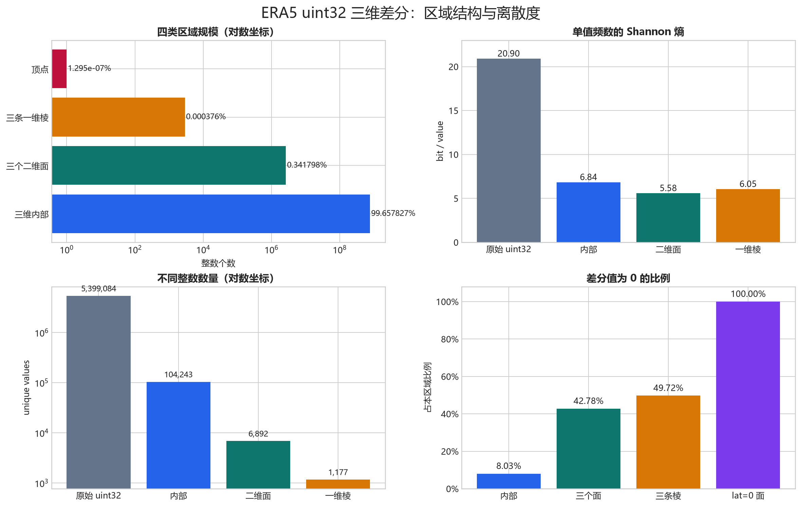
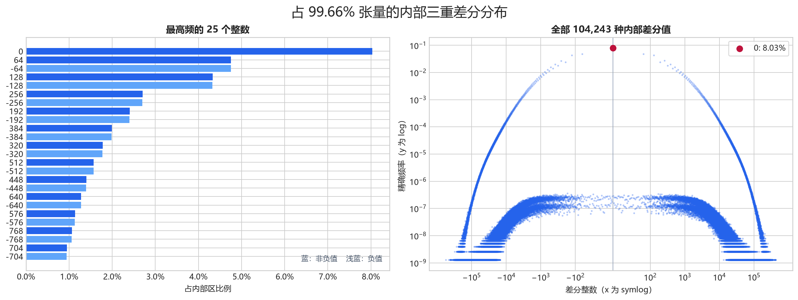
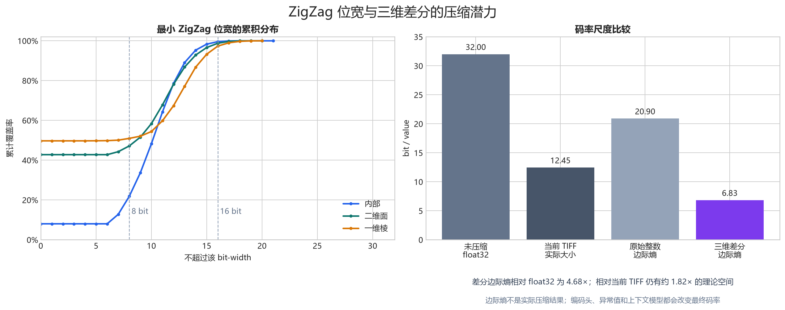
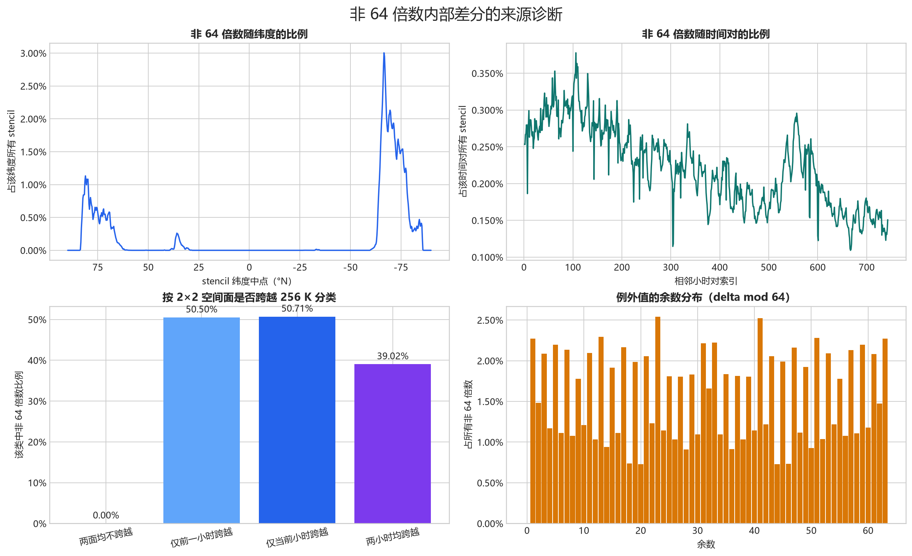
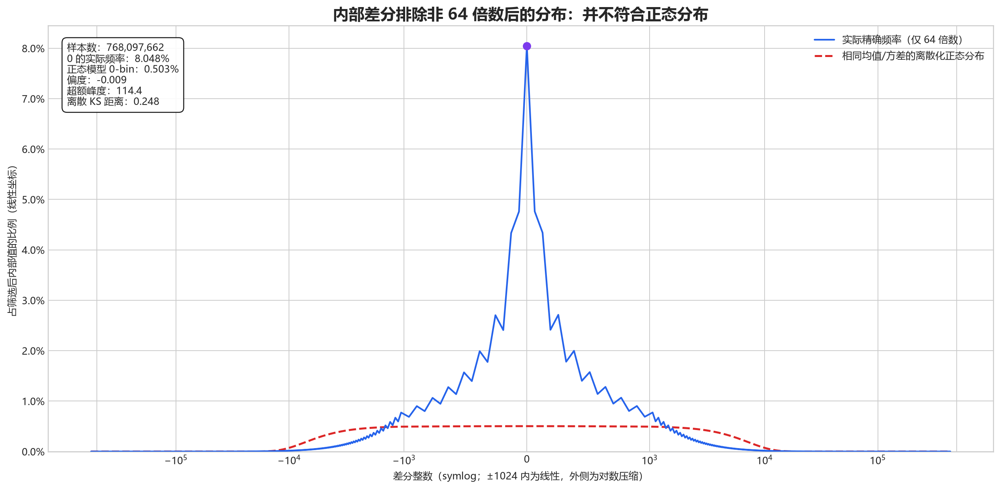

# ERA5 float32 位模式与三维差分分布

## 方法

每个 `float32` 不做数值取整，而是把其 little-endian IEEE-754 原始 4 字节
无损重解释为 `uint32`。随后按 `time → latitude → longitude` 依次做前向差分；
为避免 `uint32` 回绕，差分在 `int64` 中计算。变换可逆，且张量被严格划分为
三维内部、三个二维面、三条一维棱和一个顶点。

输入：`E:\GridData\data\ERA5-temperature-May2026_tiffs`

形状：`(744, 721, 1440)`，共 `772,450,560` 个值；
处理耗时 `45.93` 秒。

## 可视化

总览图显示内部区决定了整体压缩特征；边界所占比例很小，但极点边界具有明显的全零结构。

内部差分的中心质量高度集中在 0 和 64 的整数倍附近，同时仍存在低频长尾，因而适合“短码主体 + 异常值”编码。

码率图中的边际熵用于描述单值频数的集中程度，并非实际压缩结果。当前 TIFF 还能利用空间字节相关性，所以其实际码率低于原始整数的单值边际熵；三维差分边际熵则展示了进一步建模的方向与尺度。

### 非 64 倍数的来源诊断

这里的一个内部差分 stencil 是连续两个时次、相邻两个纬度和相邻两个经度组成的
`2×2×2` 八个点。ULP（unit in the last place）是给定数量级附近两个相邻
`float32` 数之间的间距：`[128, 256)` K 内为 `2^-16` K，`[256, 512)` K 内为
`2^-15` K。原 GRIB 的 `2^-9` K 量化步长因此分别对应 128 和 64 个 ULP。

对全部 `769,807,440` 个内部 stencil 的逐个检查结果：

| 条件 | stencil 数量 | 非 64 倍数数量 | 条件内比例 |
| --- | ---: | ---: | ---: |
| 两个 `2×2` 空间面均不跨 256 K | 765,920,975 | 0 | 0.000000% |
| 仅前一小时空间面跨 256 K | 835,106 | 421,730 | 50.500176% |
| 仅当前小时空间面跨 256 K | 832,970 | 422,375 | 50.707108% |
| 两小时空间面都跨 256 K | 2,218,389 | 865,673 | 39.022597% |
| 任一空间面跨 256 K | 3,886,465 | 1,709,778 | 43.993140% |

全部 `1,709,778` 个非 64 倍数都属于最后一类，空间跨界之外的例外数严格为 0。
另有 `168,908` 个 stencil 只在时间方向跨过 256 K、两个空间面各自不跨界，
其中非 64 倍数仍为 0。这说明破坏 64 晶格的是 `2×2` 空间差分跨过 float32
在 256 K 处的斜率变化，而不是单纯的时间升降温。

非 64 倍数 stencil 中，离 256 K 最近角点距离的中位数为 `0.0520 K`，99% 不超过
`0.6606 K`；八点温度跨度的中位数为 `1.9917 K`。纬度分布峰值位于南纬约
`66.6°`，与 5 月份 256 K 等温线穿过的高纬温度梯度带一致。并非所有跨界 stencil
都会成为例外，因为跨界产生的两组整数余量仍可能相互抵消成 64 的倍数。

### 排除非 64 倍数后的正态性

保留内部区所有能被 64 整除的 `768,097,662` 个值（包括 0），并令
`q = delta / 64`。使用相同均值和方差拟合离散化正态分布后，结果仍明显不符合
正态：分布几乎对称，但中心过尖、尾部过重，并叠加了 128 晶格造成的奇偶梳齿。

| 指标 | 实际分布 | 同均值/方差正态参考 |
| --- | ---: | ---: |
| 偏度 | -0.0092 | 0 |
| 超额峰度 | 114.3980 | 0 |
| 0 所在离散 bin 的概率 | 8.0477% | 0.5027% |
| 均值 ±1σ 覆盖率 | 91.5207% | 68.2689% |
| 均值 ±2σ 覆盖率 | 96.5529% | 95.4500% |
| 均值 ±3σ 覆盖率 | 98.1496% | 99.7300% |

离散化正态 KS 距离为 `0.2479`，总变差距离为 `0.5120`。±1σ 内异常多而 ±3σ
内反而偏少，正是“尖峰 + 重尾”的定量表现。大样本下没有必要依赖正态性检验的
微小 p 值，这些效应量与频率曲线已经足以否定正态近似。`q` 为偶数的比例是
`55.7421%`；排除 0 后仍为 `51.8687%`，对应图中由冷侧 128 晶格叠加出的轻微梳齿。
即使进一步排除 0，剩余 `706,283,398` 个值的超额峰度仍为 `104.95`，±1σ 覆盖率
仍为 `91.18%`，所以非正态性并不只是零值尖峰造成的。

差分本身包含负数和 0，因此按定义不可能服从只支持正数的对数正态分布。若把符号
单独编码、排除 0，并仅对幅度 `|q|` 拟合离散化对数正态，则 `log(|q|)` 的偏度为
`0.2485`、超额峰度为 `-0.4836`，仍不是正态；离散化对数正态 KS 距离为 `0.0336`，
总变差距离为 `0.0776`。因此它在统计意义上不符合对数正态，但作为工程上的一阶
幅度模型属于中等接近。实际编码仍应单独处理 0、符号、奇偶晶格和尾部。

## 四类区域与原始整数分布

| 区域 | 数量 | 占张量 | 不同值 | 最小值 | 最大值 | 0 占比 | 熵 (bit/value) |
| --- | ---: | ---: | ---: | ---: | ---: | ---: | ---: |
| 原始 uint32 位模式 | 772,450,560 | 100.000000% | 5,399,084 | 1,128,648,560 | 1,134,693,600 | 0.000000% | 20.8994 |
| 三维内部 ΔtΔlatΔlon | 769,807,440 | 99.657827% | 104,243 | -562,560 | 437,632 | 8.029835% | 6.8358 |
| 三个二维面（合计） | 2,640,217 | 0.341798% | 6,892 | -301,824 | 325,814 | 42.778870% | 5.5795 |
| 三条一维棱（合计） | 2,902 | 0.000376% | 1,177 | -317,184 | 130,560 | 49.724328% | 6.0515 |
| 顶点 (0,0,0) | 1 | 0.000000% | 1 | 1,132,658,378 | 1,132,658,378 | 0.000000% | 0.0000 |

这里的三个面、三条棱均互不重叠；内部 + 面 + 棱 + 顶点的数量严格等于原张量大小。
原始整数不属于差分张量的四类区域，单列作为变换前基线。

## 面与棱的分项分布

| 区域 | 数量 | 占张量 | 不同值 | 最小值 | 最大值 | 0 占比 | 熵 (bit/value) |
| --- | ---: | ---: | ---: | ---: | ---: | ---: | ---: |
| t=0 面 ΔlatΔlon | 1,036,080 | 0.134129% | 5,569 | -301,824 | 325,814 | 4.955409% | 7.9159 |
| lat=0 面 ΔtΔlon | 1,069,177 | 0.138414% | 1 | 0 | 0 | 100.000000% | 0.0000 |
| lon=0 面 ΔtΔlat | 534,960 | 0.069255% | 3,821 | -216,448 | 204,544 | 1.670405% | 7.9677 |
| t=0, lat=0 棱 Δlon | 1,439 | 0.000186% | 1 | 0 | 0 | 100.000000% | 0.0000 |
| t=0, lon=0 棱 Δlat | 720 | 0.000093% | 467 | -317,184 | 130,560 | 0.555556% | 8.6415 |
| lat=0, lon=0 棱 Δt | 743 | 0.000096% | 715 | -28,822 | 26,245 | 0.000000% | 9.4608 |

## 最高频整数

### 原始 uint32 位模式

| 整数 | 次数 | 占本区域 |
| ---: | ---: | ---: |
| 1,133,917,346 | 3,519 | 0.000456% |
| 1,133,915,810 | 3,514 | 0.000455% |
| 1,133,908,770 | 3,508 | 0.000454% |
| 1,133,916,962 | 3,502 | 0.000453% |
| 1,133,917,858 | 3,497 | 0.000453% |
| 1,133,915,170 | 3,491 | 0.000452% |
| 1,133,911,458 | 3,486 | 0.000451% |
| 1,133,916,386 | 3,486 | 0.000451% |
| 1,133,916,706 | 3,481 | 0.000451% |
| 1,133,913,506 | 3,477 | 0.000450% |
| 1,133,917,026 | 3,477 | 0.000450% |
| 1,133,906,914 | 3,470 | 0.000449% |
| 1,133,917,986 | 3,470 | 0.000449% |
| 1,133,910,434 | 3,467 | 0.000449% |
| 1,133,918,754 | 3,464 | 0.000448% |
| 1,133,914,786 | 3,461 | 0.000448% |
| 1,133,915,682 | 3,454 | 0.000447% |
| 1,133,910,306 | 3,453 | 0.000447% |
| 1,133,919,394 | 3,453 | 0.000447% |
| 1,133,909,410 | 3,450 | 0.000447% |

### 三维内部 ΔtΔlatΔlon

| 整数 | 次数 | 占本区域 |
| ---: | ---: | ---: |
| 0 | 61,814,264 | 8.029835% |
| 64 | 36,581,472 | 4.752029% |
| -64 | 36,570,224 | 4.750568% |
| 128 | 33,338,629 | 4.330775% |
| -128 | 33,296,972 | 4.325364% |
| 256 | 20,827,017 | 2.705484% |
| -256 | 20,770,582 | 2.698153% |
| 192 | 18,543,063 | 2.408792% |
| -192 | 18,498,231 | 2.402969% |
| 384 | 15,344,133 | 1.993243% |
| -384 | 15,284,197 | 1.985457% |
| 320 | 13,682,439 | 1.777385% |
| -320 | 13,639,746 | 1.771839% |
| 512 | 12,098,718 | 1.571655% |
| -512 | 12,055,301 | 1.566015% |
| 448 | 10,766,599 | 1.398609% |
| -448 | 10,726,613 | 1.393415% |
| 640 | 9,844,156 | 1.278782% |
| -640 | 9,812,116 | 1.274620% |
| 576 | 8,759,793 | 1.137920% |

### 三个二维面（合计）

| 整数 | 次数 | 占本区域 |
| ---: | ---: | ---: |
| 0 | 1,129,455 | 42.778870% |
| -64 | 39,370 | 1.491165% |
| 64 | 38,947 | 1.475144% |
| -128 | 37,651 | 1.426057% |
| 128 | 36,348 | 1.376705% |
| -256 | 29,038 | 1.099834% |
| 256 | 28,933 | 1.095857% |
| 192 | 25,756 | 0.975526% |
| -192 | 25,508 | 0.966133% |
| 384 | 24,596 | 0.931590% |
| -384 | 23,964 | 0.907653% |
| 320 | 21,947 | 0.831257% |
| -320 | 21,630 | 0.819251% |
| 512 | 21,387 | 0.810047% |
| -512 | 21,144 | 0.800843% |
| -448 | 18,772 | 0.711002% |
| 448 | 18,738 | 0.709714% |
| -640 | 18,688 | 0.707821% |
| 640 | 18,606 | 0.704715% |
| -768 | 16,783 | 0.635667% |

### 三条一维棱（合计）

| 整数 | 次数 | 占本区域 |
| ---: | ---: | ---: |
| 0 | 1,443 | 49.724328% |
| -2,752 | 7 | 0.241213% |
| -2,112 | 7 | 0.241213% |
| 832 | 6 | 0.206754% |
| 1,408 | 6 | 0.206754% |
| -4,608 | 5 | 0.172295% |
| -3,968 | 5 | 0.172295% |
| -960 | 5 | 0.172295% |
| -704 | 5 | 0.172295% |
| -128 | 5 | 0.172295% |
| 1,920 | 5 | 0.172295% |
| 3,136 | 5 | 0.172295% |
| 3,328 | 5 | 0.172295% |
| -10,240 | 4 | 0.137836% |
| -5,952 | 4 | 0.137836% |
| -1,984 | 4 | 0.137836% |
| -1,664 | 4 | 0.137836% |
| -1,472 | 4 | 0.137836% |
| -640 | 4 | 0.137836% |
| -512 | 4 | 0.137836% |

### 顶点 (0,0,0)

| 整数 | 次数 | 占本区域 |
| ---: | ---: | ---: |
| 1,132,658,378 | 1 | 100.000000% |

## 观察

- 内部区占张量的 `99.657827%`，其不同值数量为 `104,243`，0 占 `8.029835%`。
- 四类差分区域的加权边际熵为 `6.8315 bit/value`，明显低于原始位模式的 `20.8994 bit/value`。
- 内部差分经过 ZigZag 映射后，有 `99.561557%` 可放入 16 bit；最高频值集中在 0、±64、±128 等 64 的倍数。
- `lat=0` 面和对应经向棱的 0 占比均为 `100.000000%`，这是规则经纬网格极点沿经度重复产生的边界结构。
- 熵是只基于单值频数的理论下界指标，不等同于某个实际压缩器的最终码率；后续应把 ZigZag/变长 bit packing 与 Zstd 等真实编码结果进行对比。

## 输出说明

`results.json` 保存摘要、精确分位数、最高频值和 ZigZag 后的最小 bit-width 分布；
`histograms/*.csv.gz` 保存每个区域的完整、精确 `(value, count)` 频数表。
这些统计针对整数位模式，而不是开尔文温度的数值差。
