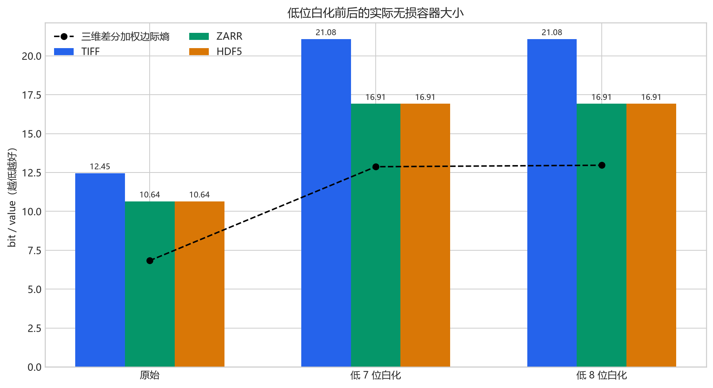
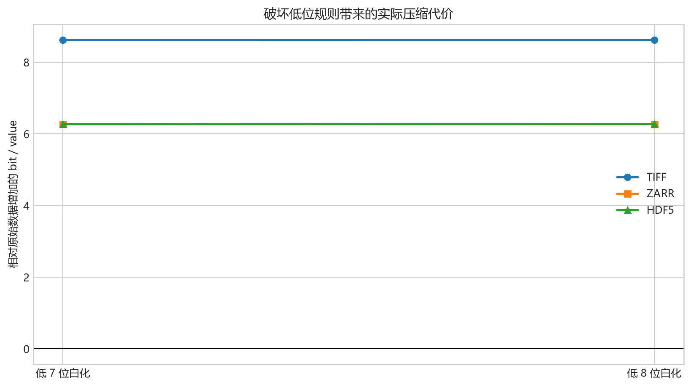

# 白化 ERA5 数据的 TIFF、Zarr、HDF5 无损压缩实测

## 方法

数据为 `float32`。低 7/8 位白化使用固定种子 `2311`，只替换 IEEE 754 位模式最低位；
所有高位保持不变。三种格式均保存相同位模式，并已逐 TIFF 或逐时间 chunk 校验。

- TIFF：256×256 tile，LZW，horizontal predictor。
- Zarr：v2，chunk `(24,128,256)`，Blosc-Zstd level 5 + bitshuffle。
- HDF5：chunk `(24,128,256)`，Blosc-Zstd level 5 + bitshuffle。

张量形状：`(744, 721, 1440)`；总值数：`772,450,560`；原始 float32 大小：`3,089,802,240` bytes。

## 实测结果

| 数据 | 格式 | 字节数 | MiB | bit/value | 相对 float32 压缩比 | 位级校验 |
| --- | --- | ---: | ---: | ---: | ---: | --- |
| 原始 | TIFF | 1,202,308,785 | 1146.61 | 12.4519 | 2.570× | 是 |
| 原始 | ZARR | 1,027,357,660 | 979.76 | 10.6400 | 3.008× | 是 |
| 原始 | HDF5 | 1,027,341,768 | 979.75 | 10.6398 | 3.008× | 是 |
| 低 7 位白化 | TIFF | 2,035,075,768 | 1940.80 | 21.0766 | 1.518× | 是 |
| 低 7 位白化 | ZARR | 1,632,970,386 | 1557.32 | 16.9121 | 1.892× | 是 |
| 低 7 位白化 | HDF5 | 1,633,041,986 | 1557.39 | 16.9128 | 1.892× | 是 |
| 低 8 位白化 | TIFF | 2,035,100,585 | 1940.82 | 21.0768 | 1.518× | 是 |
| 低 8 位白化 | ZARR | 1,633,147,722 | 1557.49 | 16.9139 | 1.892× | 是 |
| 低 8 位白化 | HDF5 | 1,633,219,073 | 1557.56 | 16.9147 | 1.892× | 是 |

## 白化代价

下表是相对同一环境中原始数据结果增加的 bit/value。

| 数据 | TIFF | Zarr | HDF5 | 三维差分加权边际熵 |
| --- | ---: | ---: | ---: | ---: |
| 低 7 位白化 | +8.6247 | +6.2721 | +6.2730 | +6.0370 |
| 低 8 位白化 | +8.6249 | +6.2740 | +6.2749 | +6.1325 |

## 结论

- 原始数据三种通用容器中最好的是 `HDF5`：`10.6398` bit/value。
- 低 7 位白化后最好的是 `ZARR`：`16.9121` bit/value；低 8 位白化后最好的是 `ZARR`：`16.9139` bit/value。
- 白化后三种通用容器都显著变差：TIFF 增加约 8.62 bit/value，Zarr/HDF5 增加约 6.27 bit/value。这证明 GRIB 定点量化形成的低位规则也一直被现有压缩器利用。
- 三维差分在低 7 位白化后仍把边际熵从 `21.1180` 降至 `12.8685` bit/value，仍降低 `8.2495` bit/value；因此差分对气温场时空相关性的利用是独立存在的，并未随低位规则一起消失。
- 原始数据中 raw→差分共降低 `14.0679` bit/value。以低 7 位白化作为反事实，约 `5.8184` bit/value 的额外降幅可归于低位定点结构，约 `8.2495` bit/value 在白化后仍保留。这个分解是实验归因，不是严格可加的最终码流预算。
- 与每组最好的通用容器相比，三维差分边际熵分别低 `3.8083`、`4.0436`、`3.9499` bit/value。白化后差距没有消失，反而仍约为 4 bit/value；但边际熵不是实际压缩文件大小，尚不能据此宣称已经获得同样码率。还需把差分值、边界和元数据真正编码并计入文件大小。
- 低 7 位与低 8 位的容器结果几乎相同，是因为第 8 个低位在原始数据中本来就具有较高变化度；随机化它新增的不可压缩信息很少。

## 图表

机器可读完整结果位于 `data/3-dim-diff-noise-container-benchmark/results.json`。
